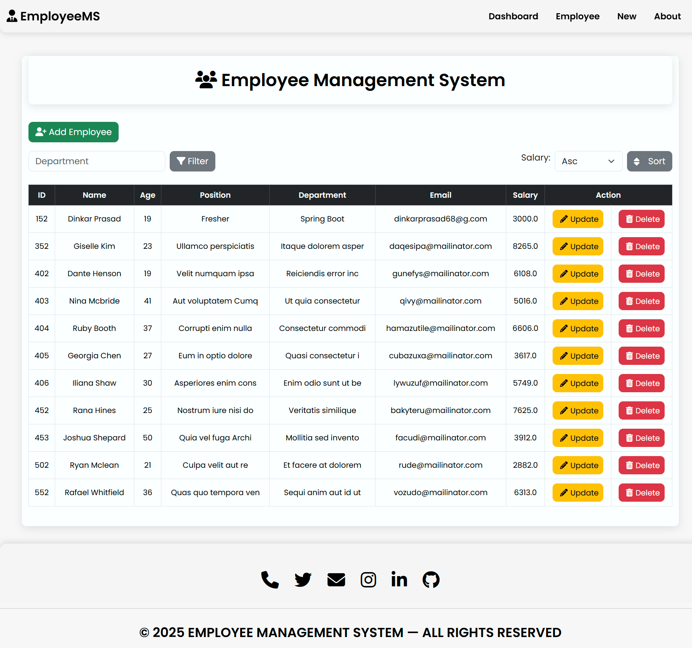
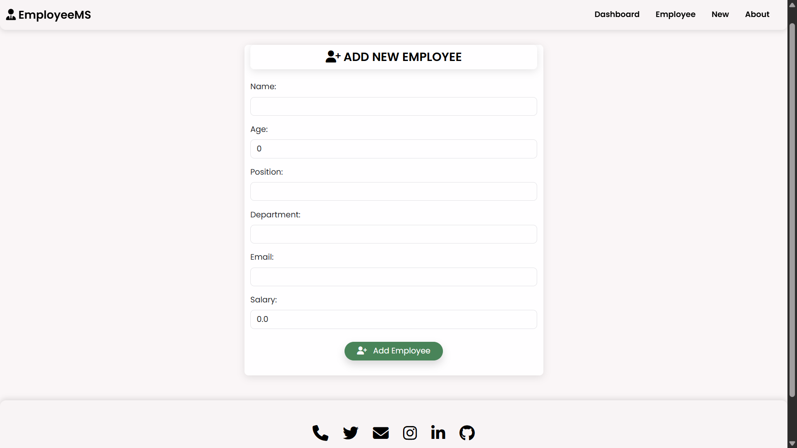
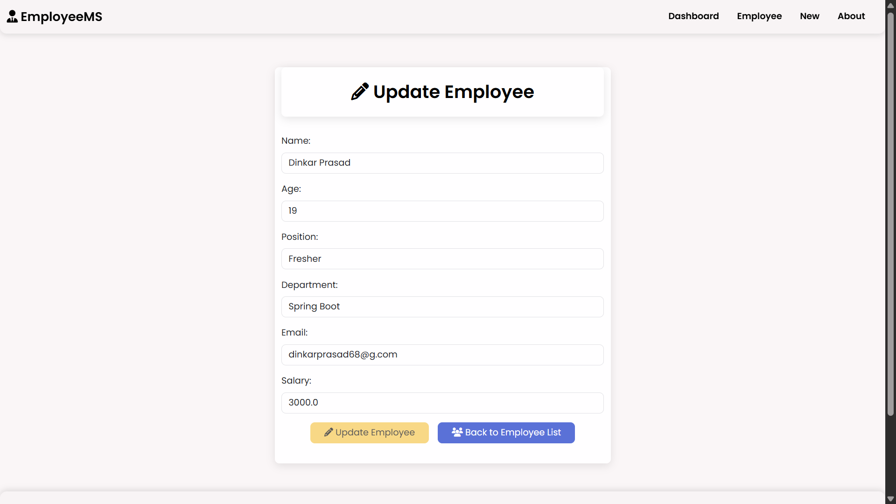

# 👨‍💼 Employee Management System                             
                       
A **full-stack web application** built with **Java, Spring Boot, Spring MVC, Hibernate, MySQL, and Thymeleaf**.  
It provides a simple and intuitive interface to manage employee records with complete **CRUD (Create, Read, Update, Delete)** functionality.

---   

## ✨ Features 
- ➕ Add new employees  
- 📋 View all employees  
- ✏️ Update employee details  
- ❌ Delete employees  
- 🔍 Search and filter employees by name, department, or role  
- ↕️ Sort employees by department  
- 🎨 Responsive UI with Thymeleaf and Bootstrap  
- 🗄️ MySQL integration using Hibernate ORM  

---

## 🛠️ Tech Stack
- ☕ **Backend:** Java, Spring Boot, Spring MVC, Hibernate  
- 🎨 **Frontend:** Thymeleaf, HTML, CSS, Bootstrap  
- 🗄️ **Database:** MySQL  
- 📦 **Build Tool:** Maven  
 

## 📸 Screenshot
All Data and Home Page:

Add Data :

Update Data :

---

    
## 🔗 Connect with me

 💼 [LinkedIn](https://www.linkedin.com/in/dinkarprasadjava)  |  🐙 [GitHub](https://github.com/DK12345678D) | 📧 [Gmail](mailto:dinkarprasad682@gmail.com) 
 
 ---

